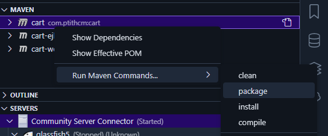
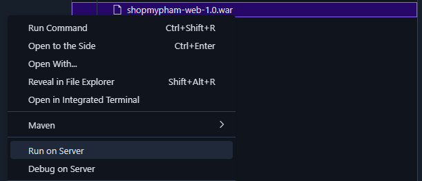

# Demo EJB with maven in VSCode
## Overview

[Placeholder for project overview and description]

## Setup and info

   Setup Instructions

### Prerequisites
- JDK 8 (jdk1.8.0_202) [check setup folder for setup file]
- Visual Studio Code Extensions:
  - Community Server Connectors
  - Maven for Java

### Installing GlassFish 5 on Community Server Connectors

1. Install the `Community Server Connectors` and `Maven for Java` extension in Visual Studio Code

2. In VSCode, look at the bottom of `EXPLORER` tab, you should see a `SERVERS` tab, start the server and right click then choose `Create new Server...`

3. CSC will ask you to download a server, choose `Yes` and search for `glassfish 5.x.x` and install it
   
   

4. Configure server settings:
   - Right click to glassfish5, choose `Edit server`
   - Domain: domain1 (default)
   - Port: 8080 (default)
   - Admin Port: 4848 (default)
   - Add one line: `"vm.install.path": "C:\\Program Files\\Java\\jdk1.8.0_202",` (change your path to jdk1.8 there)
   
   

5. Build the project
   - Create and setup your project by maven
   - Package your project (must be `war` file, check our pom setup)
   

6. Start the server:
   - In folder tree, right click at your `war` file (`<project_name>`/web/target)
   - Select "Run on Server" *or* "Debug on server"
   
   !

7. Verify installation:
   - Open browser and navigate to: `http://localhost:8080/cart-web`

### Project Setup
[Placeholder for project specific setup instructions]

Project Structure

[Placeholder for project structure documentation]

Features

[Placeholder for features list and descriptions]

API Documentation

[Placeholder for API endpoints and usage]

Contributing

[Placeholder for contribution guidelines]

